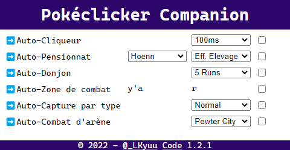

# pokeclicker-companion
Une extension chrome / edge / équivalent (pas firefox désolé p-e un jour qui sait) qui permet d'automatiser quelques éléments de gameplay.

➡️ Autoclicker - Permet de frapper automatiquement le pokémon.
> Vitesse réglable de 50ms (max) à 1s (parce que... voilà).

➡️ Autohatchery - Permet de remplir automatiquement les spots d'oeuf de la pension.
> Triable par caractéristique et par région. On ne remplit pas la file d'attente puisqu'elle perd tout son intérêt, vu que c'est automatisé.

➡️ Autodungeon - Permet de compléter automatiquement les donjons.
> L'algorithme est "bête" mais consistant, il est surtout utile pour farmer les quêtes et les achievements. Plus vous êtes loin dans l'aventure, plus il est rapide !

➡️ Autobattlefrontier - Permet de relancer automatiquement la zone de combat quand elle est terminée.
> Voilà, c'est tout.

➡️ Autocapture - Permet de capturer automatiquement les pokémon d'une route en fonction de son type.
> Voilà, c'est tout²

# Prochaines étapes
## Features
- Pouvoir indiquer une priorité de remplissage de la pension (oeufs achetés / fossiles)

## Bugs
- Bug visuel lorsqu'on lance un autodungeon, qu'on l'interrompt (ça ça marche) et qu'on le relance (là c bizarre) genre le bot fait le donjon pas de soucis mais visuellement ça s'actualise pas

- Bug visuel quand on auto-run une arène / champion dans une autre région que celle sélectionnée par le jeu, qu'on l'interromp et qu'on clique sur une route de la région.

# Installation
## Extension 
### Chrome
Vous pouvez télécharger l'extension en cliquant [ici](https://chrome.google.com/webstore/detail/pokeclicker-companion/megnhoifgnbkfomlbjjjcmjhiiaoiadn?hl=fr&authuser=0) (version publiée : 1.3.1)

### Edge
Vous pouvez télécharger l'extension en cliquant [ici](https://microsoftedge.microsoft.com/addons/detail/pokeclicker-companion/nbbeacjccocdhaaakaoegppdabcmehbb) (version publiée : 1.3.1)

## Manuellement
- cloner le repo (le gros bouton vert 'code' en haut de page => cloner ou via zip si vous êtes pas du milieu)
- aller dans votre barre d'adresse, tapez chrome://extensions ou edge://extensions ou équivalent, activer le mode développeur et cliquer sur "Charger l'extension" ou équivalent
- cliquer sur le dossier **dézippé** de ce projet
- ???
- profit

# Disclaimer
je **ne touche pas** à la sauvegarde. c'est à dire que vous pouvez faire à peu près n'importe quoi, au pire des cas la page plante psk les extensions chrome c'est une chiée à coder, mais je touche pas à la save.

don't panik, be F5

et au pire vous la retirez j'suis sûrement pas lae seul.e à avoir fait un truc comme ça

si vous aimez mon projet, que je vous ai sauvé d'un tunnel carpien, ou que vous êtes énervé.e parce que j'automatise votre jeu préféré comme un malpropre, hésitez pas à star le projet ou à mettre une évaluation sur les stores.